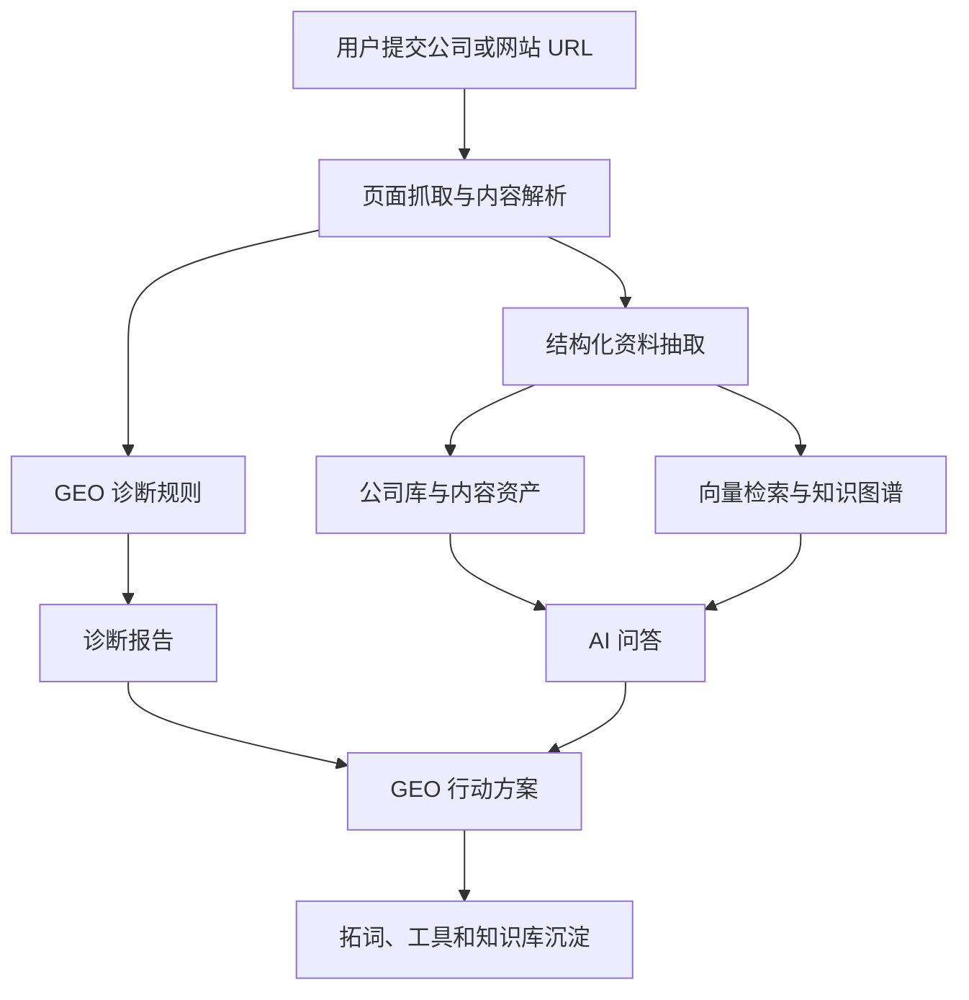

# GEOrank

简体中文 | [English](README.en.md)

GEOrank 是一个面向 GEO（生成式引擎优化）的开源工作台，帮助团队诊断网站和品牌在 AI 搜索中的可见性，并把诊断结果转化为问答、方案、拓词、结构化工具和可持续管理的内容资产。

它适合 GEO 研究者、SEO 与内容团队、品牌增长团队、AI 搜索产品团队，以及希望自托管 GEO 工具平台的开发者。

## 为什么需要 GEOrank？

搜索正在从传统结果页迁移到 AI 答案。用户不再只是在搜索引擎里点链接，而是直接向 ChatGPT、Claude、Perplexity、Gemini 等 AI 系统提问。

这带来了一组新问题：

- AI 是否能准确理解你的公司、产品和专业能力？
- 官网内容是否具备被 AI 摘要、引用和推荐的结构？
- Schema、页面结构、Meta 信息、引用信号和内容可读性，哪些应该优先优化？
- 团队如何把一次网站诊断转化为可执行的 30/60/90 天行动方案？
- 关键词、问答、教程、工具和专家资料如何沉淀成可复用资产？
- 开源项目如何支持用户使用自己的 API Key，降低平台方运行成本？

GEOrank 希望把这些分散动作收束到一个清晰的工作台中：先诊断，再提问，再生成方案，再沉淀关键词、结构化数据和知识库。

开源版默认会在 `/` 展示内置的 GEO 工作台首页，原公司列表入口保留在 `/companies`；你也可以在后台系统设置中上传或切换自己的自定义首页。

## 使用场景

- **GEO 研究与行业观察**：整理 GEO 相关公司、工具、服务商、专家和教程资料，形成可持续更新的行业知识库。
- **网站 AI 可见性诊断**：检查官网是否容易被 AI 搜索系统理解、引用和推荐，并输出可解释的诊断结果。
- **品牌与内容优化规划**：根据业务目标、网站现状、团队资源和限制条件，生成可执行的 GEO 行动方案。
- **关键词和问题资产沉淀**：围绕业务词、场景词、问题词和推荐词，生成可复用的 GEO 拓词资产。
- **AI 可读内容生产**：生成 JSON-LD、llms.txt、GEO 标题、知识库草稿等基础资产。
- **自托管 GEO 工具平台**：通过后台配置 API 池、模块开关、额度策略、自定义首页和统计代码，搭建自己的 GEO 工作台。

## GEOrank 的工作流

1. **发现**：收录和管理 GEO 相关公司、工具、专家、教程和案例。
2. **诊断**：检查网站结构、Schema、Meta、内容可读性和引用信号。
3. **问答**：围绕 GEO、AI 搜索和品牌可见性进行结构化问答。
4. **规划**：把诊断结果和业务目标转化为 GEO 行动方案。
5. **拓展**：生成关键词、问题词、场景词和内容选题资产。
6. **结构化**：生成 JSON-LD、llms.txt、标题和知识库草稿。
7. **管理**：通过后台管理模块、API、内容、自定义首页和统计代码。

## 核心功能

| 模块 | 说明 |
|---|---|
| 公司目录 | 收录和管理 GEO 相关公司、工具、服务商与案例，支持提交、审核、发布和分类 |
| 网站诊断 | 检查 Schema、页面结构、Meta 信息、内容可读性、引用信号和 AI 搜索可见性 |
| AI 问答 | 围绕 GEO、AI 搜索和品牌可见性生成结构化回答，并结合公司与诊断上下文 |
| GEO 方案 | 根据目标、网站、资源和限制条件，生成可执行的 30/60/90 天优化计划 |
| 拓词工作台 | 从业务词扩展问题词、场景词、商业意图词和推荐型关键词资产 |
| GEO 工具 | 提供 JSON-LD 生成器、llms.txt 生成器、AI 友好度评分、GEO 标题生成器和知识库生成器 |
| 专家频道 | 展示 5 位 GEO 与 AI 相关专家的公开资料、实践方向和详情介绍 |
| 教程频道 | 沉淀 GEO 基础知识、评估治理、内容结构、技术标记和实战案例 |
| 管理后台 | 管理公司、诊断、问答、拓词、专家、教程、用户、系统设置、API 池、模块开关和自定义首页 |

## 项目亮点

- **围绕 GEO 全流程设计**：不是单点工具，而是覆盖诊断、问答、方案、拓词、工具和后台管理的一套工作流。
- **自托管优先**：用户可以在自己的服务器运行系统，自己配置数据库、模型 API 和统计代码。
- **支持自定义 API 策略**：后台支持 API 池、Provider 测试、轮询和故障转移，也支持用户自定义 Key 的产品方向。
- **内容和代码分离**：公开仓库只保留代码、配置模板、demo 数据和专家频道内置公开资料；后台维护的私有内容、用户数据和运行时资产不随开源仓库发布。
- **前后台一体**：前台提供频道和工具体验，后台提供内容、模块、首页、API 和用户管理能力。
- **适合二次开发**：采用前后端分离和 monorepo 结构，方便开发者扩展频道、工具、模型和部署方式。

## 技术架构

GEOrank 采用 monorepo 架构，当前包含静态前台、Next.js 2.0 迁移代码、FastAPI 后端和共享包。

主要技术栈：

- **前台**：当前 3009 静态前台作为主要体验版本，同时保留 Next.js App Router 迁移方向。
- **后台**：Next.js 管理台，包含公司、诊断、问答、拓词、专家、教程、用户和系统设置管理。
- **后端**：FastAPI、SQLAlchemy、Alembic、Celery。
- **数据服务**：PostgreSQL、Redis、Qdrant、Neo4j、MinIO。
- **AI 层**：兼容 OpenAI 格式的 Chat 与 Embedding Provider，支持后台配置 API 池。
- **工程化**：pnpm workspace、Turborepo、OpenAPI SDK、Docker Compose。



## 目录结构

```text
GEOrank/
  apps/
    web/          # Next.js 前台
    admin/        # Next.js 管理台
  packages/
    api-sdk/      # OpenAPI 生成的 TypeScript SDK
    auth/         # 会话与页面守卫
    i18n/         # 多语言路由与字典
    ui/           # 前后台共享 UI
  backend/        # FastAPI / Celery / SQLAlchemy
  cli/            # 命令行工具
  dist/           # 当前 3009 静态前台与后台页面
  infra/          # Nginx 等基础设施配置
  docs/           # 项目文档
```

## 本地运行

> 首次运行前，请先复制环境变量模板，并填入自己的密钥。

```bash
pnpm install
cp .env.example .env
docker compose up -d

# 前台应用
pnpm dev:web

# 管理后台
pnpm dev:admin
```

涉及 AI 的功能需要配置兼容 OpenAI 格式的模型 API。你可以在 `.env` 中配置，也可以在后端运行后进入后台系统设置里配置 API 池。

## API 与模型配置

GEOrank 支持兼容 OpenAI 格式的模型服务。后台系统设置中可以配置多个 Provider，并支持：

- API Key 加密保存。
- Base URL 和模型名称配置。
- Provider 连通性测试。
- API 轮询与故障转移策略。
- 额度控制和用户自定义 Key 的产品方向。

公开版本不会包含任何真实 API Key。你需要使用自己的模型服务，并自行承担成本、隐私和合规责任。

## 开源边界

本仓库只包含 GEOrank 本地运行所需的产品代码、工程结构、配置模板和 demo 数据。

本仓库不包含：

- 真实 API Key。
- 生产数据库、向量库、图谱数据和对象存储文件。
- 未公开授权的专家资料或后台维护的私有专家内容包。
- 真实教程内容。
- 用户问答历史。
- 客户方案和诊断记录。
- 拓词词包和商业数据。
- 用户在后台上传的自定义首页运行时版本（仓库仅包含开源版内置默认首页）。

如果你要公开部署，请先确认自己的数据、模型服务和统计代码符合当地法律法规和平台政策。

## 路线图

- 完成 Next.js 2.0 前台和静态前台体验对齐。
- 持续完善 API 池、额度策略和自定义 Key 模式。
- 将教程、公司和扩展专家数据进一步拆分为公开 demo 数据和私有内容包。
- 增加更多 GEO 工具和知识库生成能力。
- 补充部署文档、截图和贡献指南。

## 贡献方式

欢迎围绕 GEO 诊断规则、前台体验、后台管理、AI 工具、部署文档和 demo 数据提交改进。提交前请确认不包含真实 API Key、私有数据或未经授权的内容资产。

## 免责声明

GEOrank 是一个面向生成式引擎优化的研究与工程项目，用于帮助团队分析和改善 AI 搜索可见性。它不出售排名，不保证任何模型一定推荐某个品牌，也不代表任何 AI 搜索平台。

## License

Apache-2.0
